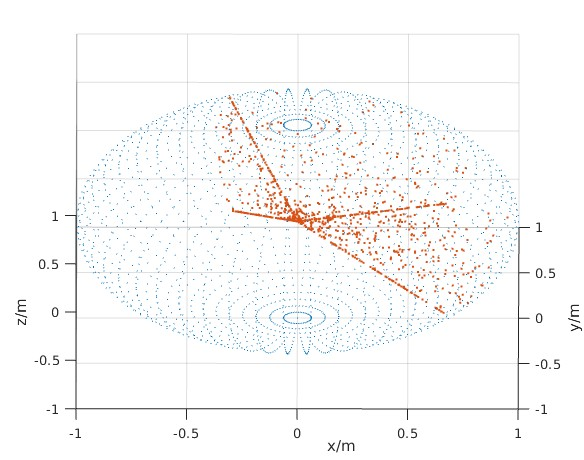

# Limited Range Octree RRT on ROS

## Introduction
lro_rrt_ros serves as wrapper around the lib_lro_rrt server (`lib_lro_rrt` package) where the input is a **pointcloud** (using the PCL library), **current pose** and **destination** and finds a collision free path in sub millisecond.

Some benefits in this module
- **[Front-end]** Using `lib_lro_rrt` which searches for obstacle free path with 2 passes (Runs a modified version of RRT*, and next is to trim/shorten the path, using local adjustments)

- This search adopts the same mindset as https://github.com/mit-acl/faster where the search will always return with a solution, as the search takes into account the local environment

- **[Simulation Map]** Using `mockamap` from `HKUST` https://github.com/HKUST-Aerial-Robotics/mockamap

- **[Sensor]** Using a "LIDAR" kind of sensor, that returns the surface of the terrain, this utilizes the modified octree functions from `lib_lro_rrt`.

- **USING LIDAR/DEPTH SENSOR** can be limited to a fixed `hfov` and a `vfov` parameters that can be changed in the launch file

- **[Local Sliding Map]** Using the sensor data concatenated with the original local cloud, we pass it into the octree, to reduce the pcl size further, whilst limiting to the AABB set around the agent

- **[Trajectory]** Using `am-traj` which provides a smooth time-optimal trajectory by ZJU, https://github.com/ZJU-FAST-Lab/am_traj

| preview | random_fov |
| :--: | :--: |
| [](lro_rrt_am.gif) | [](lro_rrt_range.jpg) |

## Setup
```bash
mkdir -p catkin_ws/src
cd catkin_ws/src
git clone https://github.com/matthewoots/lro_rrt_ros --recurse-submodules
cd ..
catkin build
```

## How to Run this module
Open 2 terminals

1. On the first terminal run `roslaunch lro_rrt_ros sample.launch` which will launch an rviz display of the map and the pose of the agent.

Rate of the search timer can be set via `planning/interval` while the `sub_runtime_error` and `runtime_error` indicates the number of iterations per cycle and the other is before returning that there is no valid search results
```bash
current ( 7.05031 -2.56862  1.86982) goal (-11.9277  27.5269  1.62967) 
sub_iterations(91)
Successful search complete after 5.0389ms
intermediate_nodes(77) iterations(91) path_size(1)
full search time taken = 5.29444ms update_octree time taken (485) = 0.13171ms update_check time taken = 0.016402ms
```

2. On the second terminal run `python3 send_command_auto.py` in the `<lro_rrt_ros>/ros1` directory. This runs a script to generate a random point that is on the opposite side of the map and pass that `goal` to the search node.  
```bash
$ python3 send_command_auto.py
[1] publish new point
[2] publish new point
[3] publish new point
[4] publish new point
...
```